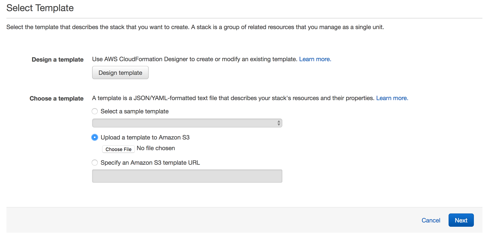
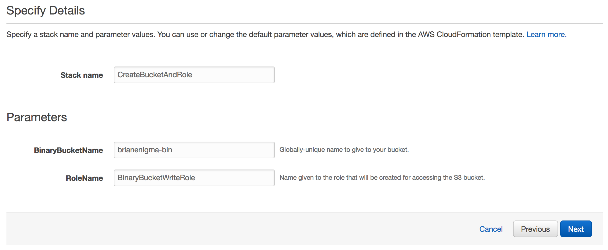
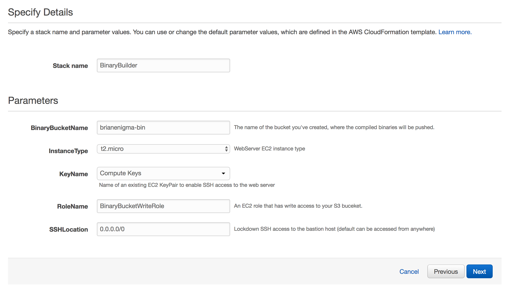
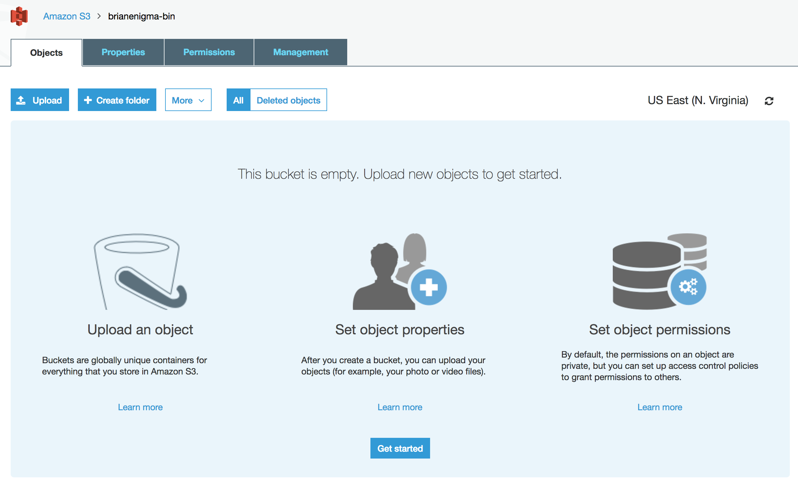
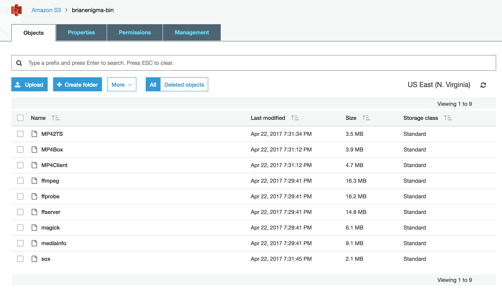

# Building Binaries with CloudFormation

For manual building or an overview of this project, please read [the top-level readme](../README.md).

There are two CloudFormation scripts available:

- [Bucket_and_Role-cloudformation.json](Bucket_and_Role-cloudformation.json) : This template creates an S3 bucket with a name of your choosing and the IAM Role to write to it.
- [EC2_Build_Machine.json](EC2_Build_Machine.json) : This template spins up an EC2 instance that grabs the build scripts from GitHub. The instance runs the build scripts and pushes them out to the S3 bucket you configured above.

First, create a new Cloud Formation stack. Use a File Upload as the source. Use `Bucklet_and_Role-cloudformation.json` as the template.

There are a couple of parameters to give this template:

- Stack name : An arbitrary name you give to the stack. `CreateBucketAndRole` is just fine.
- BinaryBucketName : This is the name of your bucket. Because of the way S3 works, it needs to be globally unique. Your best bet is to pick something somewhat unique to you, like a name or date, and append `-bin` to it. I used `brianenigma-bin` as mine.
- RoleName : This is the name of the EC2/S3 Role. It's probably fine to leave this as default.

Launch the stack, but wait until it has finished. It shouldn't take more than 5 minutes.

Once this stack has finished, create a new stack using `EC2_Build_Machine.json`.  This one needs a couple of parameters from your previous CloudFormation stack. You'll need to fill in the following:

- Stack name : An arbitrary name you give to the stack. `BinaryBuilder` is just fine.
- BinaryBucketName : This is the same name you gave to the previous script for your S3 bucket.
- KeyName : If you need to log into the instance, this is your ssh keypair that you've (hopefully!) already generated.
- RoleName : This should be the same name you gave to the previous CloudFormation template. `BinaryBucketWriteRole` should be sufficient.
- SSHLocation : You're probably fine leaving this at its default.

After kicking off this CloudFormation stack, navigate to the console view for your S3 bucket. Initially, it will be empty:

After about 20-30 minutes, if you refresh, you should see the binaries:

At this point, you can delete the EC2 stack. If you copy down the S3 bucket content and delete the files from the bucket, you can also delete the S3 stack. Alternately, you can leave it up for future scripts and processes to access.